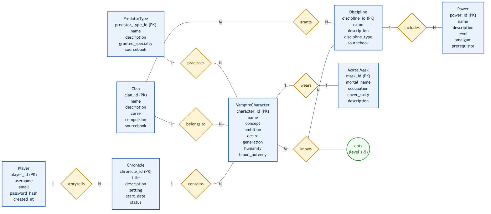

# Laboratory Work No. 1 — Creating an ER Diagram

**Subject / variant:** *"Vampire: The Masquerade 5th Edition" module of the Live D&D List application*
**Notation:** Chen (Peter Chen) ER model

---

## 1. Assignment

Perform conceptual database design using the ER ("entity–relationship") data model for the
chosen subject area. The task requires:

1. Describing the "real world" (subject area) and its modelling boundaries.
2. Forming **no fewer than 7 strong entity types**, each with **at least 4 attributes**.
3. Forming relationship types, including **at least one** relationship of each of the following
   cardinalities (with every relationship's cardinality shown on the diagram):
   - **one-to-many** (hierarchy of objects / occurrences);
   - **one-to-one**;
   - **many-to-many** with **additional relationship attributes**.
4. Iteratively re-checking the preliminary model against points 2–3.
5. Installing PostgreSQL and documenting the installation process.
6. Preparing a report containing the initial assignment and the final conceptual ER diagram.

---

## 2. Subject area and modelling scope

**Subject area:** the *Vampire: The Masquerade 5th Edition* (VtM 5) content module of the
Live D&D List application — an online tool for creating and managing vampire player characters
and the reference content used during character creation.

**In scope (modelled):**

- application users (players) and their game **chronicles** (campaigns);
- **vampire characters** with their core traits;
- reference content: **clans**, **disciplines**, **powers** and **predator types**;
- the **mortal mask** identity each vampire maintains to uphold the Masquerade.

**Out of scope (not modelled, explicitly excluded):**

- dice / Discord integration, the D&D feature–effect system, homebrew moderation, etc.

### Single instances ("examples of real-world objects")

To understand the domain we first list concrete single instances, e.g.:

- character *"Gimli"* of clan *Brujah*, predator type *Alleycat*;
- clan *"Ventrue"*, discipline *"Dominate"*, power *"Mesmerize"* (level 2);
- chronicle *"Night Over Chicago"*, mask *"John Doe, night-shift taxi driver"*.

This helps identify classes of similar objects (entity types) listed below.

---

## 3. Entity types (strong types)

| # | Entity type | Meaning | Attributes (PK in **bold**) |
|---|-------------|---------|-----------------------------|
| 1 | **Player** | application user who plays / story-tells | **player_id**, username, email, password_hash, created_at |
| 2 | **Chronicle** | a game campaign / story setting | **chronicle_id**, title, description, setting, start_date, status |
| 3 | **VampireCharacter** | a vampire player/NPC character | **character_id**, name, concept, ambition, desire, generation, humanity, blood_potency |
| 4 | **Clan** | vampire clan (e.g. Brujah, Ventrue…) | **clan_id**, name, description, curse, compulsion, sourcebook |
| 5 | **Discipline** | vampire supernatural discipline | **discipline_id**, name, description, discipline_type, sourcebook |
| 6 | **Power** | a specific power within a discipline | **power_id**, name, description, level, amalgam, prerequisite |
| 7 | **PredatorType** | way a vampire hunts/feeds | **predator_type_id**, name, description, granted_specialty, sourcebook |
| 8 | **MortalMask** | mortal cover identity (the Masquerade) | **mask_id**, mortal_name, occupation, cover_story, description |

> 8 strong entity types (≥ 7 required), each with at least 4 attributes (requirement met).

---

## 4. Relationship types (with cardinalities)

| # | Relationship | Participants | Cardinality | Function / business rule |
|---|--------------|--------------|-------------|---------------------------|
| R1 | **storytells** | Player — Chronicle | **1 : N** | One player storytells many chronicles; a chronicle has exactly one owner player. |
| R2 | **contains** | Chronicle — VampireCharacter | **1 : N** | One chronicle contains many characters; a character belongs to exactly one chronicle (hierarchy). |
| R3 | **belongs to** | Clan — VampireCharacter | **1 : N** | One clan has many vampires; each vampire belongs to exactly one clan. |
| R4 | **practices** | PredatorType — VampireCharacter | **1 : N** | One predator type describes many vampires; each vampire has one predator type. |
| R5 | **includes** | Discipline — Power | **1 : N** | One discipline contains many powers; a power belongs to exactly one discipline (hierarchy). |
| R6 | **knows** | VampireCharacter — Discipline | **M : N** (+ attribute **dots**) | A character knows many disciplines; a discipline is known by many characters. The relationship attribute **dots** stores the mastery level (1–5). |
| R7 | **grants** | Clan — Discipline | **M : N** | A clan grants several disciplines; a discipline is granted to several clans. |
| R8 | **wears** | VampireCharacter — MortalMask | **1 : 1** | Each vampire maintains exactly one mortal mask; a mask belongs to exactly one vampire. |

Requirement coverage:

- **one-to-many**: R1, R2, R3, R4, R5 ✓ (hierarchy in R2, R3, R5)
- **one-to-one**: R8 ✓
- **many-to-many with a relationship attribute**: R6 (attribute *dots*) ✓
- cardinalities shown on **every** relationship ✓

---

## 5. ER diagram (Chen notation)

Entities are shown as rectangles, relationship types as diamonds, and cardinalities
(**1**, **N**, **M**) are written on every edge. The **dots** attribute of the R6 relationship is
shown as an oval attached to the relationship, following the Chen convention for relationship
attributes.

*(Source file: `vtm5-er-diagram.mmd`; vector copy: `vtm5-er-diagram.svg`.)*

### 5.1 Notes on semantics / business rules

- **Clan vs. Discipline (R6, R7).** A clan *grants* a set of disciplines (R7), and a character
  *knows* disciplines at a certain number of dots (R6). These are two functionally different
  relationships, so an combined M:N with the `dots` attribute could not replace R7 — hence they
  are kept separate.
- **1:1 rationale.** The **wears** relationship is intentionally 1:1: in this model every vampire
  is assumed to maintain exactly one mortal mask (a simplification of the Masquerade; characters
  juggling several identities would require a different business rule and a 1:N cardinality).
- **`dots` attribute** is kept as a relationship attribute (not an entity attribute) because it
  depends on the *pair* (character, discipline), which is exactly the many-to-many case the task
  requires.

---

## 6. PostgreSQL installation (Windows, EDB installer)

This section documents the installation of PostgreSQL using the official EDB installer on Windows
(x86-64). Each step is described and marked for a corresponding screenshot.

1. **Download the installer.** Open the official PostgreSQL download page
   (*https://www.postgresql.org/download/windows/*), select the *Windows* family, and click
   **Download the installer** (EDB). *(screenshot 1)*
2. **Choose the version.** On the EDB download page pick the latest stable version for
   *Windows x86-64* and download the `.exe` file. *(screenshot 2)*
3. **Run the installer.** Launch the downloaded file; the welcome (start) screen appears.
   *(screenshot 3)*
4. **Installation directory.** Leave the default path proposed by the installer.
   *(screenshot 4)*
5. **Select components.** Keep **PostgreSQL Server**, **pgAdmin 4** and **Command Line Tools**;
   *Stack Builder* can be left unchecked. *(screenshot 5)*
6. **Data directory.** Leave the default `data` directory path (stored DB, configuration and
   server logs). *(screenshot 6)*
7. **Superuser password.** Set and remember the password for the `postgres` superuser.
   *(screenshot 7)*
8. **Port.** Keep the default port **5432**. *(screenshot 8)*
9. **Locale.** Select **Default locale** (uses the operating system's language/regional
   settings). *(screenshot 9)*
10. **Pre-installation summary.** Review all chosen parameters; go back if something is wrong.
    *(screenshot 10)*
11. **Ready to install.** Confirm and start the installation. *(screenshot 11)*
12. **Installation progress.** Wait for the progress bar to complete. *(screenshot 12)*
13. **Completion.** The installer reports a successful finish; PostgreSQL is ready to use.
    *(screenshot 13)*

> Note: in the Live D&D List project itself PostgreSQL runs via the bundled Docker image
> (`postgres:18-alpine`); the steps above document the standalone Windows installation required
> by this laboratory task.

---

## 7. Conclusion

For the *"Vampire: The Masquerade 5th Edition"* module, a conceptual ER model was designed
covering players, chronicles, vampire characters, clans, disciplines, powers, predator types and
mortal masks. The model contains **8 strong entity types** (each with **4 or more attributes**)
and **8 relationship types**, including the required **one-to-many** (hierarchy), **one-to-one**
and **many-to-many with an additional attribute** (`dots`) relationships, with cardinalities
labelled on every edge. The model was iteratively re-checked against the task requirements, and
the PostgreSQL installation process on Windows was documented step by step.